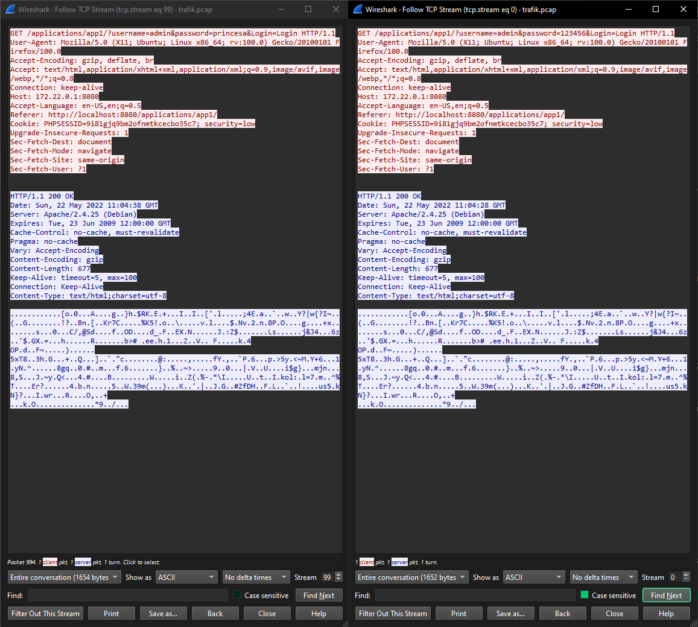
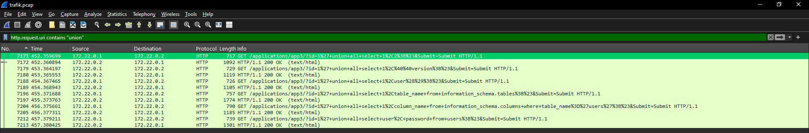
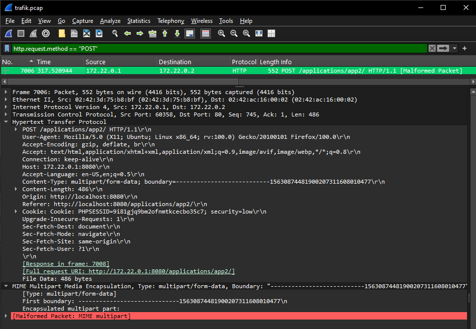

# FRA challenge: Olika angrepp

## Initial observation

Opened the PCAP file in Wireshark.

Initial impression:
- Number of packets: 9901
- Duration: 00:16:15
- First timestamp: 2022-05-22 13:04:28
- Last timestamp: 2022-05-22 13:20:43

No filtering applied yet.

## File statistics

- Total packets: [9901]
- Duration: 00:16:15
- Average packet rate: 10.2

This helps estimate how much data we are dealing with.

## Network overview

Identified IP addresses:

Internal (likely):
- 172.22.0.1
- 172.22.0.2

External (suspicious/unknown):
- None observed

Observations:
- Only two hosts are present in the capture, communicating exclusively with each other
- Both 172.22.0.1 and 172.22.0.2 have similar traffic volume (~2 MB each)
- The communication appears to be internal, suggesting attacker activity within the network or a simulated environment

## Protocol analysis

Observed protocols:
- Ethernet
- IPv4
- TCP
- HTTP

Potential attack surfaces:
- HTTP → possible credential exposure, command execution, and data exfiltration
- TCP → underlying transport, useful for session tracking and stream analysis

### HTTP Traffic Overview

Filtered all HTTP traffic to focus on potential web-based attacks.

### Attack 1 – Credential Brute Force / Credential Stuffing

Multiple HTTP GET requests were observed targeting the login functionality.

Observed patterns:
- Multiple usernames were tested
- Multiple passwords were attempted for each username
- Credentials were transmitted in cleartext via HTTP

Analysis:
- The attacker is performing a credential stuffing / brute force attack
- The attack targets multiple accounts rather than a single user
- This increases the likelihood of successful compromise

Note:
- All responses returned HTTP 200 OK, indicating that status codes alone cannot determine authentication success
- Response content must be analyzed for confirmation

### TCP Stream Analysis

Two representative login attempts were analyzed:

- password=123456
- password=princesa

Findings:
- Both responses returned HTTP/1.1 200 OK
- Content-Length was identical (677 bytes)
- Response structure and content appeared consistent

Conclusion:
- The application returns identical responses regardless of authentication success or failure
- It is not possible to determine successful login attempts based on response analysis alone

### Vulnerability

The application contains multiple security weaknesses:

- Credentials are transmitted via HTTP GET parameters, exposing sensitive information in cleartext
- No rate limiting or account lockout mechanism is in place, allowing unlimited login attempts
- Weak passwords are accepted (e.g., common passwords such as "123456")
- The application provides identical responses for all login attempts, making it difficult to detect successful authentication

These weaknesses make the application highly susceptible to brute force and credential stuffing attacks.

### Severity

Medium to High

The attack demonstrates that the application is vulnerable to brute force and credential stuffing attacks.

Although successful authentication could not be definitively confirmed, the lack of protective mechanisms and the use of weak credentials significantly increase the risk of account compromise.

Worst-case scenario:
- Unauthorized access to user accounts
- Potential administrative access
- Further exploitation of the system

The absence of rate limiting and secure authentication mechanisms allows attackers to systematically attempt credential combinations without restriction.

### Attack 2 – Remote Command Execution (Web Shell)

After filtering out login attempts, new HTTP requests were identified targeting a file:

/hackable/uploads/funny.php

Observed parameters:
- cmd=id
- cmd=ls -la
- cmd=cat /etc/passwd
- cmd=cat /etc/shadow
- cmd=uname -r
- cmd=arch

Analysis:
- The attacker is executing system commands via a web-accessible script
- This indicates the presence of a web shell

Conclusion:
- The attacker has achieved remote code execution on the target system

### Vulnerability

- File upload vulnerability (malicious PHP file)
- Lack of input validation
- Remote command execution via unsanitized input

### Severity

Critical

The attacker is able to execute arbitrary system commands and access sensitive system files, including password hashes.

### MITRE ATT&CK

- T1059 – Command and Scripting Interpreter
- T1105 – Ingress Tool Transfer
- T1003 – OS Credential Dumping

### Attack 3 – SQL Injection (Data Exfiltration)

Multiple HTTP requests containing SQL injection payloads were identified targeting the "id" parameter in:

/applications/app3/

Observed payloads include:

- UNION SELECT statements
- Enumeration of database metadata via information_schema
- Extraction of sensitive data from application tables

Examples:
- union all select 1,2,3
- union all select @@version
- union all select table_name from information_schema.tables
- union all select column_name from information_schema.columns
- union all select user,password from users

Analysis:
- The attacker successfully injects SQL queries into the application
- The database structure is enumerated
- Sensitive data, including user credentials, is extracted

Conclusion:
- The application is vulnerable to SQL injection
- The attacker has successfully accessed database contents

### Vulnerability

- SQL injection due to lack of input sanitization
- User-controlled input is directly used in SQL queries
- No parameterized queries or prepared statements

### Severity

Critical

The attacker is able to extract sensitive database information, including user credentials.

Worst-case scenario:
- Full database compromise
- Credential reuse across systems
- Privilege escalation and lateral movement

### MITRE ATT&CK

- T1190 – Exploit Public-Facing Application
- T1005 – Data from Local System
- T1552 – Unsecured Credentials

### Attack 4 – File Upload (Web Shell Deployment)

A POST request to the following endpoint was identified:

/applications/app2/

The request contains multipart/form-data, indicating a file upload operation.

Although the packet is marked as malformed, key indicators confirm file upload activity:
- Use of HTTP POST method
- multipart/form-data content type
- Presence of MIME boundaries

Shortly after this request, a PHP file is accessed:

/hackable/uploads/funny.php

Analysis:
- The attacker likely uploaded a malicious PHP file via this request
- The uploaded file is later used to execute system commands

Conclusion:
- The attacker successfully deployed a web shell on the server
- This enabled remote command execution and full system interaction

### Vulnerability

- Unrestricted file upload
- Lack of server-side validation
- Executable files allowed in upload directory

Even though the upload content is not fully visible, the sequence of events provides strong evidence of successful web shell deployment.
